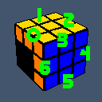
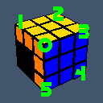

## Table of contents
* [General info](#general-info)
    * [Single cube solve](#single-cube-solve)
        * [Scrambling sequence](#scrambling-sequence)
        * [Cube state defintion](#cube-state-definition)
    * [Generator](#cube-generator)
        * [Criteria](#criteria)
    * [Solution analyser](#solution-analyser)
    * [Solve parameters](#solve-parameters)
* [Setup](#setup)
    * [Requirements](#requirements)
    * [Linux](#linux)
* [How to run](#how-to-run)
    * [Single cube solve run](#single-cube-solve-run)
        * [Scrambling sequence based](#scrambling-sequence-based)
        * [Cube state defintion based](#cube-state-definition-based)
        * [Custom solve parameters](#custom-solve-parameters)
        * [Output formatting options](#output-formatting-options)
    * [Cube generator run](#cube-generator-run)
* [Other options](#other-options)
* [Known bugs](#known-bugs)

## General info
This is not a regular Rubik's Cube solver. This application deals with a very specific subset of states, called RU group. Without resorting to math, the RU group can be described as a subset of states
achievable by scrambling a solved cube using only R, R2, R', U, U2, U' moves. It appears as a substep of various Rubik's cube solving systems, like the one I use in Fewest Moves event: Tsai Method.
The application operates in one of the three modes:

* [single cube solve](#single-cube-solve)

* [generator](#cube-generator)

* [solution analyser](#solution-analyser)


### Single cube solve
In this mode a single cube is solved.
The cube can be defined in two different ways.

#### Scrambling sequence
Any sequence containing zero or more moves from the following set is considered a valid scramble: {R, R2, R', U, U2, U'}

Some example valid scrambles:

* `R2 U2 R2 U2 R2 U2`

* `R U R' U R U2 R'`

* `R' U R' U' R' U' R' U R U R2`

More details regarding input formats and how to use this mode, can be found in the [How to run](#how-to-run) section.

#### Cube state definition
In order to fully define the cube state one must provide correct edges permutation, corners permutation and corners orientation.
The application assigns numerical labels to cube pieces in the following manner.

| part | diagram | labels |
|------|---------|--------|
|edges| | UF = 0 <br /> UL = 1 <br /> UB = 2 <br /> UR = 3 <br /> BR = 4 <br /> DR = 5 <br /> FR = 6 |
|corners| | URF = 0 <br /> UFL = 1 <br /> ULB = 2 <br /> UBR = 3 <br /> DRB = 4 <br /> DFR = 5 |

In order to specify a permutation, one just needs to go through these positions in that order, and see what pieces are there.

Orientation is specified in a similar way, but instead of what piece is in a given position, its orientation is of our interest there.

Only three corner orientations are possible:

0 - oriented\
1 - needs 1 clockwise rotation\
2 - needs 2 clockwise rotations

The application expects corners permutation (CP) and corners orientation (CO) specified as a single sequence of the following format:

CO<sub>0</sub>CP<sub>0</sub>CO<sub>1</sub>CP<sub>1</sub>...CO<sub>5</sub>CP<sub>5</sub>

And finally, the entire cube state should be defined like this:

CO<sub>0</sub>CP<sub>0</sub>CO<sub>1</sub>CP<sub>1</sub>...CO<sub>5</sub>CP<sub>5</sub>;EP<sub>0</sub>EP<sub>1</sub>...EP<sub>6</sub>

Have a look at the examples below if that's not clear.

More details regarding input formats and how to use this mode, can be found in the [How to run](#how-to-run) section.

#### Example cubes
A solved cube:

```
EP: 0123456
CP: 012345
CO: 000000
CO + CP: 000102030405
whole: 000102030405;0123456
```

R U R' U' R2 U2 R U R U R':

```
EP: 6430125
CP: 052413
CO: 212010
CO + CP: 201522041103
whole: 201522041103;6430125
```

### Cube generator
[This feature is a work in progess]

Generating large portions of algorithms manually one by one can be painful and very time consuming. Here's where the cube generator feature comes in handy.
Instead of specifying a single cube, one specifies a set of rules the generator uses to generate and then solve all possible cube states matching provided criteria.

#### Criteria
Cube generator uses the same cube state format as single solve mode:

CO<sub>0</sub>CP<sub>0</sub>CO<sub>1</sub>CP<sub>1</sub>...CO<sub>5</sub>CP<sub>5</sub>

But instead of providing concrete values, like these:

```
201522041103;6430125
```

One is expected to provide the following information:

##### Corners orientation
* G - piece state will be generated (from non-ignored and non-locked values)
* I - piece will be ignored
* [0..2] value - piece state will be locked to the provided value (number of clockwise turns needed to orient the piece correctly)

##### Corners & edges permutation
* G - piece state will be generated (from non-ignored and non-locked values)
* I - piece state will be ignored
* L - piece will stay solved

##### Examples
* All possible cubes:
```
GGGGGGGGGGGG;GGGGGGG
```

* PLLs:
```
0G0G0G0G0L0L;GGGGLLL
```

* All LL corners orientations:
```
GLGLGLGL0L0L;LLLLLLL
```

* Corners only, edges ignored:
```
GGGGGGGGGGGG;IIIIIII
```

### Solution analyser
[This feature is a work in progress]

It's a bit of a long shot, but the ultimate goal of this project is to find an optimal human-friendly way of solving the RU phase.
I believe that in-depth analysis of optimal, computer-generated solutions may be of help. That's is exactly what this feature is about.

More details will follow.

### Solve parameters
One can specify the following solve parameters:

* solution move range
* max number of solutions
* solved masks

First two are self-explanatory. Solved masks require explanation.

They allow user to tell the solver what parts of the cube are expected to be solved (1), and what may be left scrambled (0).\
The application expects here the very same format as in cube state definition. The only difference is that this time instead of numeric labels, it expects 0s for cube parts to be ignored
and 1s for parts expected to be solved. Custom masks won't work in [Generator](#cube-generator).

CO<sub>0</sub>CP<sub>0</sub>CO<sub>1</sub>CP<sub>1</sub>...CO<sub>5</sub>CP<sub>5</sub>;EP<sub>0</sub>EP<sub>1</sub>...EP<sub>6</sub>


#### Example masks

| solved part               | masks [ corners; edges ]  |
|:--------------------------|:--------------------------|
| entire cube               | ```111111111111;1111111```|
| edges only                | ```000000000000;0000000```|
| corners only              | ```111111111111;0000000```|
| corners orientation only  | ```101010101010;0000000```|
| corners permutation only  | ```010101010101;0000000```|
| F2L pieces only           | ```000000001111;0000111```|


More details regarding input formats can be found in the [How to run](#how-to-run) section.

## Setup

### Requirements

#### Tools and libraries:

Prerequisites installation is covered in the sections below.

#### Hardware:

* At least 3GB of free disk space

* At least 3GB of free system memory

* The faster the processor the better

### Linux

Install compilers, make, cmake and git:
```
sudo apt-get update && apt-get install -y git build-essential cmake
```


Get ruCubeAnalyser repo and update submodules:

```
git clone https://github.com/piotoor/ruGroupAnalyser.git && \
cd ruGroupAnalyser/lib && \
git submodule update --init --recursive && \
cd ..
```

Build project:

```
mkdir build && \
cd build && \
cmake .. -DCMAKE_BUILD_TYPE=Release && \
make all
```

If you want to build unit tests as well, provide this option to cmake:

```
cmake .. -DCMAKE_BUILD_TYPE=Release -DBUILD_TEST=ON
```


## How to run

Binaries can be found in ruGroupAnalyser/build/release directory.

```
cd release
```

To run the application, one must at least provide the mandatory `-m` (`--mode`) argument, using the following format:

```
./ruGroupAnalyser -m="M;C"
```

where `M` defines the mode:

* S - single cube solve from scramble

* s - single cube solve from state

* g - generator mode (not available yet)

* a - analysis mode (not available yet)

and `C` defines criteria, specific to the chosen mode. Described in details below.

### Single cube solve run

#### Scrambling sequence based
To solve a cube from a scramble, run this:
```
$ ./ruGroupAnalyser_run -m="S;R U R U R2 U R' U' R U2 R2"
```

Example output:
```
Generating edges permutation move map...        DONE (9 ms)
Generating corners permutation move map...      DONE (1 ms)
Generating corners orientation move map...      DONE (0 ms)
Generating edges permutation solved table...    DONE (1 ms)
Generating corners permutation solved table...  DONE (0 ms)
Generating corners orientation solved table...  DONE (0 ms)
Loading edges pruning table...                  DONE (2 ms)
Loading corners pruning table...                DONE (2 ms)
Loading full cube pruning table (17)...         DONE (8057 ms)
Loading permutation validity table...           DONE (16 ms)
R2 U2 R' U R U' R2 U' R' U' R'
```

Everytime the application is run, it starts with generating and loading lookup tables. When it's done, the cube gets solved and solutions printed. With default settings on,
only one solution is generated and output is not formatted. In the subsequent examples, lookup table - related printouts will be omitted.

#### Cube state definition based

To solve a cube from a defined cube state:
```
./ruGroupAnalyser_run -m="s;201522041103;6430125"
```

Output:
```
R U' R' U' R' U2 R2 U R U' R'
```

#### Custom solve parameters

Here are the parameters one can use to customize the solving process.

`-n=I --num-of-sols=I`   number of solutions per cube (1-; default=1)

`-l=I --min-length=I`    min solution length (0-20; default=0)

`-h=I --max-length=I`    max solution length (0-20; default=20)

`-s=S --solved-mask=S`   solved mask (format: "001101010101;1010011")

Here's an example:
```
./ruGroupAnalyser_run -m="S;R U R U R2 U R' U' R U2 R2 U R' U' R" -n=25 -l=12 -h=19 -s="000000001111;0000111"
```

And the output:
```
R' U' R U' R2 U R2 U R U2 R' U
R' U' R U' R2 U R2 U R U2 R' U2
R' U' R U' R2 U R2 U R U2 R' U'
R' U' R' U R U' R' U' R' U2 R U
R' U' R' U R U' R' U' R' U2 R U2
R' U' R' U R U' R' U' R' U2 R U'
R' U' R' U R' U R2 U2 R2 U2 R U
R' U' R' U R' U R2 U2 R2 U2 R U2
R' U' R' U R' U R2 U2 R2 U2 R U'
R' U' R' U2 R U2 R' U' R' U' R U
R' U' R' U2 R U2 R' U' R' U' R U2
R' U' R' U2 R U2 R' U' R' U' R U'
U R U' R' U2 R U' R2 U R U R
U R2 U2 R U R2 U2 R U' R2 U R
U R2 U' R' U' R' U' R U' R2 U R
U R' U R U R2 U' R U2 R' U' R'
U R' U2 R' U R U2 R2 U R2 U R
U R' U2 R' U' R' U' R U' R' U' R'
U R' U' R' U' R' U2 R U' R2 U R
U2 R U R' U2 R2 U' R' U R2 U' R
U' R2 U2 R2 U R' U' R' U' R' U' R'
U' R2 U2 R' U R2 U2 R2 U R U2 R'
U' R2 U' R2 U' R2 U R' U2 R' U' R'
R U R2 U' R' U R U' R' U R' U2 R
R U R2 U' R' U R U' R' U2 R' U R

```


#### Output formatting options

By default, no output formatting is applied. Here are the available options:

`-H --headers`           headers and footers

`-L --line-numbers`      line numbers

`-F --fixed-width`       fixed width moves


Let's use the same solve as before and add formatting options:

```
./ruGroupAnalyser_run -m="S;R U R U R2 U R' U' R U2 R2 U R' U' R" -n=25 -l=12 -h=19 -s="000000001111;0000111" -H -L -F

```

Output:

```
Solutions of length 12...
1.   R' U' R  U' R2 U  R2 U  R  U2 R' U
2.   R' U' R  U' R2 U  R2 U  R  U2 R' U2
3.   R' U' R  U' R2 U  R2 U  R  U2 R' U'
4.   R' U' R' U  R  U' R' U' R' U2 R  U
5.   R' U' R' U  R  U' R' U' R' U2 R  U2
6.   R' U' R' U  R  U' R' U' R' U2 R  U'
7.   R' U' R' U  R' U  R2 U2 R2 U2 R  U
8.   R' U' R' U  R' U  R2 U2 R2 U2 R  U2
9.   R' U' R' U  R' U  R2 U2 R2 U2 R  U'
10.  R' U' R' U2 R  U2 R' U' R' U' R  U
11.  R' U' R' U2 R  U2 R' U' R' U' R  U2
12.  R' U' R' U2 R  U2 R' U' R' U' R  U'
13.  U  R  U' R' U2 R  U' R2 U  R  U  R
14.  U  R2 U2 R  U  R2 U2 R  U' R2 U  R
15.  U  R2 U' R' U' R' U' R  U' R2 U  R
16.  U  R' U  R  U  R2 U' R  U2 R' U' R'
17.  U  R' U2 R' U  R  U2 R2 U  R2 U  R
18.  U  R' U2 R' U' R' U' R  U' R' U' R'
19.  U  R' U' R' U' R' U2 R  U' R2 U  R
20.  U2 R  U  R' U2 R2 U' R' U  R2 U' R
21.  U' R2 U2 R2 U  R' U' R' U' R' U' R'
22.  U' R2 U2 R' U  R2 U2 R2 U  R  U2 R'
23.  U' R2 U' R2 U' R2 U  R' U2 R' U' R'

Solutions of length 13...
24.  R  U  R2 U' R' U  R  U' R' U  R' U2 R
25.  R  U  R2 U' R' U  R  U' R' U2 R' U  R

Solutions found: 25
Solving time: 5ms
```


### Cube generator run
Example:
```
./ruGroupAnalyser_run -m="g;0G0G0G0G0L0L;GGGGLLL"
```

Output:
```
Generating corners orientation move map...      DONE (0 ms)
Generating corners permutation move map...      DONE (0 ms)
Generating edges permutation move map...        DONE (0 ms)
Generating corners orientation solved table...  DONE (0 ms)
Generating corners permutation solved table...  DONE (0 ms)
Generating edges permutation solved table...    DONE (0 ms)
Loading corners orient pruning table...         DONE (0 ms)
Loading corners perm pruning table...           DONE (0 ms)
Loading edges pruning table...                  DONE (0 ms)
Loading corners pruning table...                DONE (0 ms)
Loading full cube pruning table (17)...         DONE (425 ms)
Loading permutation validity table...           DONE (2 ms)
You are about to generate and solve 48 cubes...
DONE

The following optimizations have been applied to reduce the output size:
+--------------------------+-------+-------+
| parameters               | old   | new   |
+--------------------------+-------+-------+
| maxNumOfSolutions        | 1     | 1     |
| headers                  | false | false |
| line numbers             | false | false |
| fixed width font         | false | false |
| summary                  | false | false |
| compressed solution      | false | false |
| compressed cube state    | false | false |
+--------------------------+-------+-------+

Number of threads: 12
Generating...DONE
(9 ms)
```

In this mode, generated solutions are not printed on the console. They are saved to a text file called "default.ruc" (This will be setable in the future).
There's also a new table that shows what optimizations had to be applied to make the solutions file fit in the available disk space. Yes, generating all possible
cubes together with maxNumOfSolutions set to a high value and all output formatting options enabled, can produce extremely large files.
Solutions file looks like this. The output can vary, depending on what formatting options have been set. The format should be pretty self-explanatory right now.
```
+------------+-------+
|000102030405;0123456|
+------------+-------+


+------------+-------+
|000102030405;0231456|
+------------+-------+
R' U R' U' R' U' R' U R U R2

+------------+-------+
|000102030405;0312456|
+------------+-------+
R2 U' R' U' R U R U R U' R

+------------+-------+
|000102030405;1320456|
+------------+-------+
R2 U R U R' U' R' U' R' U R'

+------------+-------+
|000102030405;3021456|
+------------+-------+
R U' R U R U R U' R' U' R2

+------------+-------+
|000102030405;3102456|
+------------+-------+
R U2 R U R U R2 U' R' U' R2

+------------+-------+
|000102030405;2130456|
+------------+-------+
R2 U R U R2 U' R' U' R' U2 R'

+------------+-------+
|010203000405;1230456|
+------------+-------+
U

+------------+-------+
|000102030405;2301456|
+------------+-------+
R2 U2 R U2 R2 U2 R2 U2 R U2 R2

+------------+-------+
|010203000405;0132456|
+------------+-------+
R U' R U R U R U' R' U' R2 U

+------------+-------+
|010203000405;0213456|
+------------+-------+
R U2 R U R U R2 U' R' U' R2 U

+------------+-------+
|010203000405;1023456|
+------------+-------+
R2 U' R' U' R U R U R U' R U

+------------+-------+
|010203000405;2031456|
+------------+-------+
R2 U R U R' U' R' U' R' U R' U

+------------+-------+
|010203000405;1302456|
+------------+-------+
R' U R' U' R' U' R' U R U R2 U

+------------+-------+
|010203000405;3012456|
+------------+-------+
R2 U2 R2 U2 R2 U R2 U2 R2 U2 R2

+------------+-------+
|010203000405;3201456|
+------------+-------+
R2 U R U R2 U' R' U' R' U2 R' U

+------------+-------+
|000102030405;1203456|
+------------+-------+
U R' U R' U' R' U' R' U R U R2 U'

+------------+-------+
|010203000405;2310456|
+------------+-------+
U R' U R' U' R' U' R' U R U R2

+------------+-------+
|010203000405;3120456|
+------------+-------+
U R2 U' R' U' R U R U R U' R

+------------+-------+
|020300010405;0123456|
+------------+-------+
R2 U2 R U2 R2 U2 R2 U2 R U2 R2 U2

+------------+-------+
|020300010405;0312456|
+------------+-------+
R2 U R U R2 U' R' U' R' U2 R' U2

+------------+-------+
|000102030405;2013456|
+------------+-------+
U R2 U' R' U' R U R U R U' R U'

+------------+-------+
|020300010405;2301456|
+------------+-------+
U2

+------------+-------+
|020300010405;0231456|
+------------+-------+
U2 R U2 R U R U R2 U' R' U' R2

+------------+-------+
|020300010405;1320456|
+------------+-------+
R U2 R U R U R2 U' R' U' R2 U2

+------------+-------+
|020300010405;1203456|
+------------+-------+
R U' R U R U R U' R' U' R2 U2

+------------+-------+
|020300010405;2013456|
+------------+-------+
R' U R' U' R' U' R' U R U R2 U2

+------------+-------+
|020300010405;3102456|
+------------+-------+
R2 U R U R' U' R' U' R' U R' U2

+------------+-------+
|020300010405;2130456|
+------------+-------+
R2 U' R' U' R U R U R U' R U2

+------------+-------+
|020300010405;3021456|
+------------+-------+
U2 R2 U R U R2 U' R' U' R' U2 R'

+------------+-------+
|030001020405;0213456|
+------------+-------+
R2 U R U R' U' R' U' R' U R' U'

+------------+-------+
|030001020405;1023456|
+------------+-------+
R2 U R U R2 U' R' U' R' U2 R' U'

+------------+-------+
|030001020405;0132456|
+------------+-------+
U' R2 U R U R' U' R' U' R' U R'

+------------+-------+
|030001020405;1230456|
+------------+-------+
R2 U2 R2 U2 R2 U' R2 U2 R2 U2 R2

+------------+-------+
|030001020405;3012456|
+------------+-------+
U'

+------------+-------+
|030001020405;2031456|
+------------+-------+
R U2 R U R U R2 U' R' U' R2 U'

+------------+-------+
|030001020405;1302456|
+------------+-------+
U' R U' R U R U R U' R' U' R2

+------------+-------+
|030001020405;2310456|
+------------+-------+
R U' R U R U R U' R' U' R2 U'

+------------+-------+
|000102030405;1032456|
+------------+-------+
R2 U' R2 U' R U2 R2 U2 R2 U2 R U R2 U R2

+------------+-------+
|020300010405;1032456|
+------------+-------+
R U R' U R' U' R' U R U' R' U' R2 U R

+------------+-------+
|010203000405;0321456|
+------------+-------+
R2 U R2 U2 R2 U R2 U' R2 U R2 U2 R2 U R2

+------------+-------+
|000102030405;3210456|
+------------+-------+
R2 U R2 U R U2 R2 U2 R2 U2 R U' R2 U' R2

+------------+-------+
|020300010405;3210456|
+------------+-------+
R U R2 U' R' U' R U R' U' R' U R' U R

+------------+-------+
|030001020405;0321456|
+------------+-------+
R2 U' R2 U2 R2 U' R2 U R2 U' R2 U2 R2 U' R2

+------------+-------+
|030001020405;3120456|
+------------+-------+
R' U R' U' R' U' R' U R U R2 U'

+------------+-------+
|030001020405;3201456|
+------------+-------+
R2 U' R' U' R U R U R U' R U'

+------------+-------+
|010203000405;2103456|
+------------+-------+
R U R2 U' R' U' R U R' U' R' U R' U R U'

+------------+-------+
|030001020405;2103456|
+------------+-------+
R U R' U R' U' R' U R U' R' U' R2 U R U


```

#### Custom solve parameters
Same options avaliable as in [Custom solve parameters](#custom-solve-parameters), except for custom solved masks.

Warning: In cube generator mode these options are treated as suggestions. Whether they will or will not be applied depends on the estimated solution report
size, which can be optimized when the available disk space is too low.

## Other options

Here's how to print help and usage screen:

`-? -h --help`           show help screen

`-u --usage`             show usage screen


## Known bugs
- [ ] Lookup tables are generated even when the application is run with help options.
